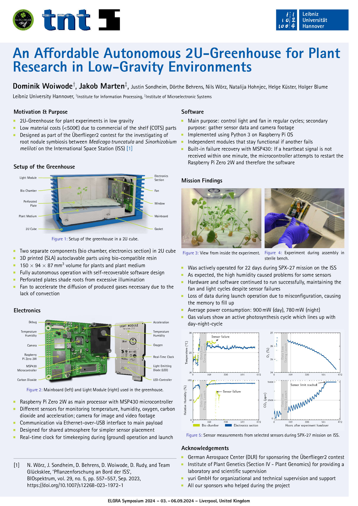

# ELGRA Symposium 2024 - An Affordable Autonomous 2U-Greenhouse for Plant Research in Low-Gravity Environments

## Abstract
### Introduction
Observing and monitoring plants in low gravity is a challenging and cost-intensiv task.
Due to the increasing interest in biotech experiments conducted in space [1], there is a demand for affordable and easy-to-manage containers for biological experiments.
We propose a 2U (200x100x100mm³) low-cost and autonomous greenhouse consisting of commercial of the shelf (COTS) parts.
As part of the student project “Glücksklee”, it was successfully launched during the SPX-27 mission and stayed aboard the International Space Station (ISS) in the TangoLab facility for 30 days [2].
During the mission, the greenhouse provided an environment for the growth of 13 Medicago Truncatula plants.

### Method
The greenhouse is divided into two parts: 1) an autoclavable biochamber with an outer dimension of ~150x94x87mm³ containing the experiment and 2) a technical part to monitor the experiment e.g. with camera images, temperature, humidity, pressure, acceleration, carbon dioxide and oxygen sensors.
Both parts are screwed together to tightly fit in a 2U container while allowing gas exchange between them.

A radial fan is used to prevent the accumulation of toxic gases that are produced by the plants.
9 LEDs simulate an adjustable day/night cycle.
The Raspberry Pi Zero 2W runs a modular software that controls the actuators, retrieves and distributes sensor data and communicates with the TangoLab facility.
A separate microcontroller was implemented to reboot the system in case of a software malfunction.

### Results
By using mostly COTS parts we were able to provide a complete experiment setup with a material budget of less than 500€.
The experiment consumed less than 1.5 watts on average.
Although the humidity reached 100% in some parts of the experiment all critical components survived for the whole duration of the mission without any failure.
A secondary temperature/humidity sensor next to the LEDs yielded implausible values after 6 days in space.

### Conclusion
Our main contribution consists of a modular and affordable design that separates the handling of technical parts and the experiment.
With our mission onboard the ISS we verified the system's functionality in low-gravity environments and identified design flaws.
An extendable framework for various different sensors and actuators is available to adapt this system for future missions.
The system is now also used by others as ground preparation module for other space missions.

## Compiling the poster
To compile the poster you need the LUH corporate font [Rotis](https://www.corporate.uni-hannover.de/de/die-marke/hausschrift) installed as OpenType font in the folder `font/rotis/`.
As this has special license requirements, it is not included in this repository.
Compiling was only tested using TeX Live 2022. Previous versions might not have all required packages. 

The poster has to be compiled using XeLaTeX or LuaLaTeX:
`lualatex poster.tex` oder `latexmk -pdflua poster.tex`

## Acknowledgements
The Glücksklee mission was made possible thanks to the guidance of yuri GmbH and the organization and financing of the Überflieger2 contest by the German Aerospace Center (DLR). The authors express their gratitude for their support.
The authors also thank the Institute of Plant Genetics (Section Plant Genomics) and the Institute of Microelectronic Systems for providing the necessary facilities and equipment.

- [1] Elsaesser, A., Burr, D.J., Mabey, P. et al. ‘Future space experiment platforms for astrobiology and astrochemistry research.‘, npj Microgravity 9, 43 (2023). https://doi.org/10.1038/s41526-023-00292-1
- [2] N. Wörz, J. Sondheim, D. Behrens, D. Woiwode, D. Rudy, and Team Glücksklee, ‘Pflanzenforschung an Bord der ISS’, BIOspektrum, vol. 29, no. 5, pp. 557–557, Sep. 2023, https://doi.org/10.1007/s12268-023-1972-1
